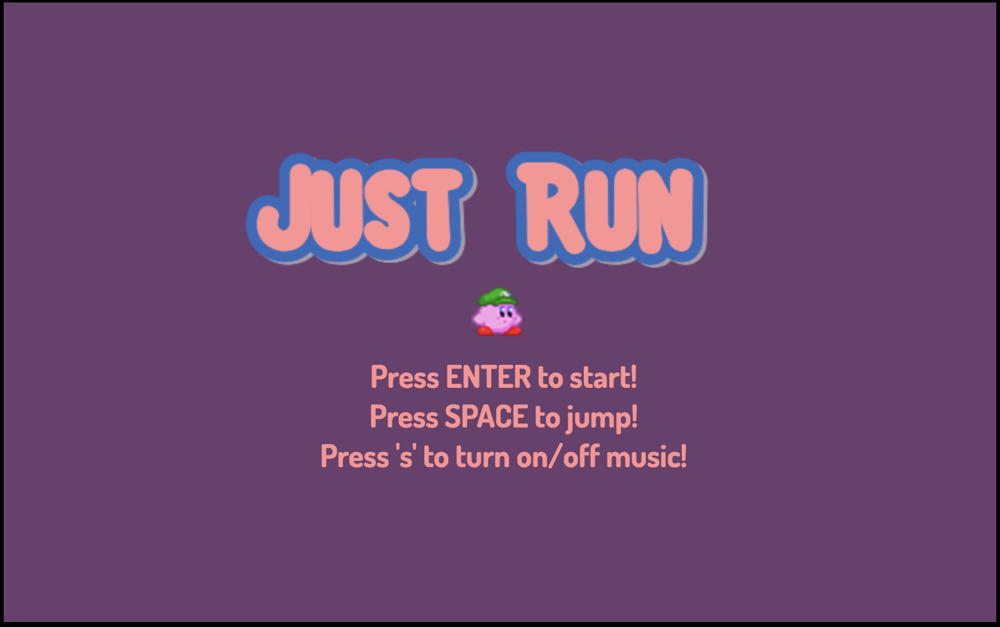

# Just Run

## Background
[Live Link](http://maggiechen.me/JustRun/)




Just Run is an infinite run game inspired by Google's T-Rex Run! The goal of the game is to last as long as possible, avoiding the enemies that appear.

## Instructions
Press ENTER to start and SPACE to jump to avoid enemies and collect coins.

## Technologies
- Javascript
- HTML5 Canvas


## Features and Implementation

All features were implemented using only native JavaScript and HTML5 Canvas.


### Collision Detection

Collision occurs when the two objects intersect. In this game, objects were represented as rectangles to encapsulate their entire areas. Collision detection was used to detect if the player collided with an enemy and if the player collided with a coin.

```JavaScript
gameOver() {
    return !(
      this.kirby.xPos > this.enemyDimX + this.chosenEnemy.width - Game.ENEMY_OFFSET.xOffset ||
      this.kirby.xPos + this.kirby.width < this.enemyDimX + Game.ENEMY_OFFSET.xOffset ||
      this.kirby.yPos > this.enemyDimY + this.chosenEnemy.height - Game.ENEMY_OFFSET.yOffset ||
      this.kirby.yPos + this.kirby.height < this.enemyDimY + Game.ENEMY_OFFSET.yOffset
    );
  }

coinCollision() {
    return !(
      this.kirby.xPos > this.coin.xPos + this.coin.width ||
      this.kirby.xPos + this.kirby.width < this.coin.xPos ||
      this.kirby.yPos > this.coin.yPos + this.coin.height ||
      this.kirby.yPos + this.kirby.height < this.coin.yPos
    );
  }
```

## Future Features
- [ ] Add options for player
- [ ] Add multi-player feature
- [ ] Connect to a backend database to store high scores

### Legal

The artwork and music used in this project are for educational purposes only. The artwork and music are property of Nintendo.


