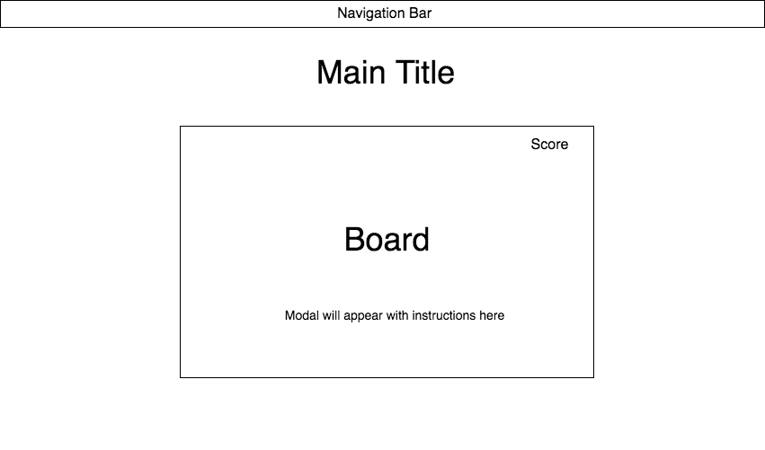

# Just Run

### Background

Just Run is an infinite run game inspired by Google's T-Rex Run! The goal of the game is to last as long as possible, avoiding the obstacles that appears.

### Functionality & MVP 

With Just Run, users will be able to:

- [ ] Use the spacebar to jump
- [ ] User enter to start the game
- [ ] Turn the music on/off using the "s" key

In addition, this project will include:

- [ ] A production README

### Architecture and Technologies

The project will be implemented with the following technologies:

-`Javascript` for game logic, webpack to bundle Javascript files, and HTML5 Canvas to draw the graphics.

The following are the main scripts that will be implemented:

`game.js`: this script will handle the logic for the game and rendering the the enemies

`kirby.js `: this script will handle the logic for rendering the player

`enemy.js`: this script will handle the state of all of the enemies

`coin.js`: this script will handle the logic for rendering the coin

`score.js `: this script will handle the logic for rendering the player's score

### Wireframes

The app will consist of a single screen with the game board and navigation bar. The navigation bar will contain nav links to the Github repository, my LinkedIn, and my portfolio site. The title will be on the navigation bar and on the game board.

### Implementation Timeline

**Day 1**: 
- Setup all the files needed for webpack to start running.
- Write a basic entry file.
- Complete board design.

**Day 2**: 
- Complete player script, where the player jumps when the space bar is pressed.
- Complete enemy script, where the enemy enters board after the previous enemy leaves.

**Day 3**: 
- Complete coin item script, where items disappear on collision.
- Complete score script, where the score updates for every enemy passed and coin collected.

### Future Features
- [ ] Add options for player
- [ ] Add multi-player feature
- [ ] Connect to a backend database to store high scores

### Legal

The artwork and music used in this project are for educational purposes only. The artwork and music are property of Nintendo.

